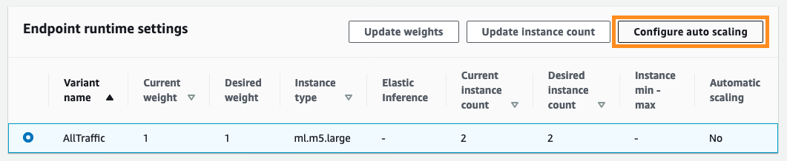

## Building scalable KoGPT2 model inference using Amazon SageMaker by extending MXNet inference container


## Objective

In order to host a KoGPT-2 model in Amazon SageMaker, you need to extend SageMaker MXNet inference container by installing KoGPT-2 package because it is not included in the default SageMaker inference container. In this guide, I will walk through the steps from building a custom container image, uploading the model to Amazon S3, to deploying the model to Amazon SageMaker for real-time inference at scale.


## Step 1. Build a custom MXNet inference container image for KoGPT2

### Cloning the container repository

First of all, clone SageMaker MXNet serving container git repository. You can do this anywhere as long as docker is installed. I do this on an Amazon EC2 instance.

```bash
git clone https://github.com/aws/sagemaker-mxnet-serving-container.git

cd sagemaker-mxnet-serving-container
```

### Updating Dockerfile (to install KoGPT2)

Next is to modify Dockerfile. Because we will build a docker image with Apache MXNet 1.6.0 and Python 3.6 for GPU support included, let’s modify `./docker/1.6.0/py3/Dockerfile.gpu` file. Insert the below lines after mxnet and it related package installation part. The last 7 lines in the blow are to be added. If you want to build a CPU version of the container image, then please modify `./docker/1.6.0/py3/Dockerfile.cpu` instead.

```bash
RUN ${PIP} install --no-cache-dir \
    ${MX_URL} \
    git+git://github.com/dmlc/gluon-nlp.git@v0.9.0 \
    gluoncv==0.6.0 \
    mxnet-model-server==$MMS_VERSION \
    keras-mxnet==2.2.4.1 \
    numpy==1.17.4 \
    onnx==1.4.1 \
    "sagemaker-mxnet-inference<2"

# For KoGPT2 installation
RUN git clone https://github.com/SKT-AI/KoGPT2.git \
&& pip install sentencepiece>=0.1.6 \
&& pip install torch>=1.4.0 \
&& pip install transformers>=2.1.1 \
&& cd KoGPT2 \
&& pip install .
```

### Building a container image

Now it is time to build the container image. Before executing `docker build` command, copy necessary files to `./docker/1.6.0/py3` directory. In this example, we use`preprod-mxnet-serving:1.6.0-gpu-py3` as the name and the tag. Please do not miss the dot at the end of the command.

```bash
cp -r docker/artifacts/* docker/1.6.0/py3

cd docker/1.6.0/py3

docker build -t preprod-mxnet-serving:1.6.0-gpu-py3 -f Dockerfile.gpu .
```

### Testing the container image

When the building container image is finished, let's check if the container image is correctly built by running a container using the built image and accessing the shell. Replace `docker image id` and `container name` with what you get from `docker images` and `docker ps` command output. In the container shell, you might want to check if `kogpt2` package is installed without any problem and further run a KoGPT2 example.

```bash
# find docker image id
$ docker images
REPOSITORY                                            TAG                               IMAGE ID            CREATED             SIZE
preprod-mxnet-serving                                 1.6.0-gpu-py3                     0012f8ebdcab        24 hours ago        6.56GB
nvidia/cuda                                           10.1-cudnn7-runtime-ubuntu16.04   e11e11484e2e        3 months ago        1.71GB

# run docker
$docker run <docker image id>

$ docker ps
CONTAINER ID        IMAGE               COMMAND                  CREATED             STATUS              PORTS               NAMES
af357bce0c53        0012f8ebdcab        "python /usr/local/b…"   7 hours ago         Up 7 hours          8080-8081/tcp       musing_napier

# access shell of the running docker
$ docker exec -it <container name> /bin/bash
```

### Uploading the container image to Amazon ECR

Now we are ready to upload our KoGPT2 enabled container image to Amazon Elastic Container Registry(ECR) so that we can point to this container image when we deploy the model within Amazon SageMaker. Please refer to “[Pushing an Image](https://docs.aws.amazon.com/AmazonECR/latest/userguide/docker-push-ecr-image.html)” of Amazon ECR documentation for the detail. In short, just 4 steps to follow. First, you need to authenticate Docker to Amazon ECR registry with get-login-password. Assuming AWC CLI is prior to 1.17.0, run the below line to get `docker login` command. If you use AWS CLI 1.17.0 or higher, please refer to “[Using an Authorization Token](https://docs.aws.amazon.com/AmazonECR/latest/userguide/Registries.html#registry_auth)” of Amazon ECR documentation. Copy the output of the command, and paste and execute it get authenticated.

```bash
$ aws ecr get-login --region <AWS region name> --no-include-email
```

### Creating an Amazon ECR repository

The second step is to create an Amazon ECR repository. You can do this using AWS console or AWS CLI. AWS CLI command to create one is  simply  `aws ecr create-repository` command. If you want to use the existing ECR repository, you can skip this. Let’s use `kogpt2` as the repository name and `ap-northeast-1` as AWS region to use Seoul region.

```bash
$ aws ecr create-repository --repository-name <repository name> --region <AWS region name>
```

### Creating a new tag on the image

Now, let assign a new tag to the image using the name of the ECR repository you want to use. Check the container image ID again using `docker images` command, and run `docker tag` command with the repository URI. Again, replace `AWS account ID`,  `AWS region` , and `repository name` properly.

```bash
$ docker images
REPOSITORY              TAG                               IMAGE ID            CREATED             SIZE
preprod-mxnet-serving   1.6.0-gpu-py3                     698f5cefa0cf        5 hours ago         6.56GB
nvidia/cuda             10.1-cudnn7-runtime-ubuntu16.04   e11e11484e2e        3 months ago        1.71GB

$ docker tag <image id> <AWS account ID>.dkr.ecr.<AWS region>.amazonaws.com/<repository name>

$ docker images
REPOSITORY                                            TAG                               IMAGE ID            CREATED             SIZE
preprod-mxnet-serving                                 1.6.0-gpu-py3                     0012f8ebdcab        2 minutes ago       6.56GB
<AWS account ID>.dkr.ecr.<AWS region>.amazonaws.com/kogpt2   latest                            0012f8ebdcab        2 minutes ago       6.56GB
nvidia/cuda                                           10.1-cudnn7-runtime-ubuntu16.04   e11e11484e2e        3 months ago        1.71GB
```

### Pushing the image to Amazon ECR repository

The last step is to push the image to the Amazon ECR repository. Use the repository name returned from `docker images` command. Once done, let’s check if the image is successfully pushed using `aws ecr list-images` AWS CLI command.

```bash
$ docker push <AWS acconut ID>.dkr.ecr.<AWS region>.amazonaws.com/<repository name>

$ aws ecr list-images --repository-name <repository name>
{
    "imageIds": [
        {
            "imageDigest": "sha256:66bc1759a4d2e94daff4dd02446024a11c5af29d9259175f11701a0b9ee2d2d1",
            "imageTag": "latest"
        }
    ]
}
```

## Step 2. Upload the model to Amazon S3

You might want to fine-tune the KoGPT2 model to solve your own NLP problem and deploy the model to Amazon SageMaker. Since Fine-tuning KoGPT2 model is not the topic of this post, let’s use the pre-trained KoGPT2 model and do text generation as an example.

Run the example found in [KoGPT2 git repository](https://github.com/SKT-AI/KoGPT2), then you can find two files under `~/kogpt2` directory. One is the Apache MXNet model parameter file and the other is a sentencepiece vocabulary file. Create .tar.gz of the two and upload it to Amazon S3 bucket.

```bash
$ cd ~/kogpt2
$ tar cvfz model.tar.gz ./*.params ./*.spiece
$ aws s3 cp ./model.tar.gz s3://<your bucket name>/gpt2-model/model.tar.gz
```

## Step 3. Deploying the model to Amazon SageMaker

Now that the MXNet inference container is ready to be used and the model artifact (.tar.gz) file is also stored in Amazon S3, it is time to deploy the model to Amazon SageMaker so that others could send request API requests. To do that, a model, an endpoint configuration, and an endpoint should be created in Amazon SageMaker. Using SageMaker Python SDK simplifies these tasks via defining an MXNetModel object and then calling `deploy()` on that object. 

Before we define MXNetModel and deploy it, let’s first take a look at the inference python code, which implements two Multi Model Server interfaces, `model_fn()` and `transform_fn()`. `model_fn()` is for loading the model which has been copied into the inference instance from Amazon S3 bucket, and `transform_fn()` is to fulfill the request by making inference and returning the inference output. In `transform_fn()`, you handle input processing, prediction, and output processing all together. If you want to separate them, you can do so via `input_fn()`, `predict_fn()`, and `output_fn()` respectively instead of `transform_fn()`. For more detail on the usage, please refer to “[The SageMaker MXNet Model Server](https://sagemaker.readthedocs.io/en/stable/using_mxnet.html#the-sagemaker-mxnet-model-server)” in SageMaker Python SDK documentation.

```python
import os
import json
import glob
import time
    
import mxnet as mx
import gluonnlp as nlp

from gluonnlp.data import SentencepieceTokenizer
from kogpt2.model.gpt import GPT2Model as MXGPT2Model
from kogpt2.utils import get_tokenizer

def get_kogpt2_model(model_file,
                     vocab_file,
                     ctx=mx.cpu(0)):
    vocab_b_obj = nlp.vocab.BERTVocab.from_sentencepiece(vocab_file,
                                                         mask_token=None,
                                                         sep_token=None,
                                                         cls_token=None,
                                                         unknown_token='<unk>',
                                                         padding_token='<pad>',
                                                         bos_token='<s>',
                                                         eos_token='</s>')
    mxmodel = MXGPT2Model(units=768,
                          max_length=1024,
                          num_heads=12,
                          num_layers=12,
                          dropout=0.1,
                          vocab_size=len(vocab_b_obj))
    mxmodel.load_parameters(model_file, ctx=ctx)
    
    return (mxmodel, vocab_b_obj)

def model_fn(model_dir):    
    voc_file_name = glob.glob('{}/*.spiece'.format(model_dir))[0]
    model_param_file_name = glob.glob('{}/*.params'.format(model_dir))[0]
    
    # check if GPU is available
    if mx.context.num_gpus() > 0:
        ctx = mx.gpu(0)
    else:
        ctx = mx.cpu(0)
        
    model, vocab = get_kogpt2_model(model_param_file_name, voc_file_name, ctx)
    tok = SentencepieceTokenizer(voc_file_name)
    
    return model, vocab, tok

def transform_fn(model, request_body, content_type, accept_type):
    model, vocab, tok = model
    
    sent = request_body.encode('utf-8')
    sent = sent.decode('unicode_escape')[1:]
    sent = sent[:-1]
    toked = tok(sent)
    
    t0 = time.time()
    while 1:
      input_ids = mx.nd.array([vocab[vocab.bos_token]]  + vocab[toked]).expand_dims(axis=0)
      pred = model(input_ids)[0]
      gen = vocab.to_tokens(mx.nd.argmax(pred, axis=-1).squeeze().astype('int').asnumpy().tolist())[-1]
      if gen == '</s>':
        break
      sent += gen.replace('▁', ' ')
      toked = tok(sent)
    
    response_body = json.dumps([sent, time.time() - t0])
    
    return response_body, content_type
    
```

When you create an MXNetModel object, you should give the pointer to the container image via `image` parameter we’ve uploaded to Amazon ECR repository above because the default MXNet inference container does not have KoGPT2 installed. A python file of the inference code is passed as `entry_point`. In this example, the inference code is to generate the remaining words on a given a partial sentence. 

You can also set the number of workers, `model_server_workers`, to be launched in the inference instance. By default (as of now, Mar 31 2020), the default is 1. To fully utilize the CPU or GPU resources of the inference instance, you need to increase this value. However, if it is set too large, out-of-memory error will be thrown because each worker loads the model independently.

```python
import sagemaker
from sagemaker.mxnet.model import MXNetModel
from sagemaker import get_execution_role

sagemaker_session = sagemaker.Session()
role = get_execution_role()

model_data = 's3://<your bucket name>/gpt2-model/model.tar.gz'
entry_point = './gpt2-inference.py'

mxnet_model = MXNetModel(model_data=model_data,
                         role=role,
                         entry_point=entry_point,
                         py_version='py3',
                         framework_version='1.6.0',
                         image='<AWS account id>.dkr.ecr.<AWS region>.amazonaws.com/kogpt2:latest',
                         model_server_workers=2
                        )
```

Then, you call `deploy()` function of the model object with some configuration parameters such as which instance type to use, and how many initial instances to be launched. 

```python
predictor = mxnet_model.deploy(instance_type='ml.c5.large, initial_instance_count=1)
```

Auto scaling is not enabled by default. You can enable Auto Scaling with AWS console, and find the guide on how to enable it at “[Auto Scaling is now available for Amazon SageMaker](https://aws.amazon.com/blogs/aws/auto-scaling-is-now-available-for-amazon-sagemaker/)” post. For the further detail on Auto Scaling, please refer to “[Define a scaling policy](https://docs.aws.amazon.com/sagemaker/latest/dg/endpoint-auto-scaling-add-code-define.html)” in Amazon SageMaker documentation. In this tutorial, let’s set Auto Scaling with a simple scaling policy which scales out if the number of invocation per instance is 3 or more. Go to Amazon SageMaker web console, and select the endpoint to work with. There is a section for “Endpoint runtime settings” on the endpoint detail page. Select the variant name (here ‘AllTraffic’) and click on “Configure auto scaling” button.



You will be guided to the configuration page where you can set the scaling configuration such as minimum instance count, maximum instance count, and scaling policy when to scale out and in with cool down period. Once you set, click on “Save” button at the bottom to apply the change.


It will take some time to apply the auto scaling to this endpoint. If all are correct, “Automatic scaling” will be shown as “Yes”.


## Inference performance of difference ML instance types


Before the endpoint is put into production, it is a good time to measure the model inference latency and throughput. You can run a stress test tool on the endpoint. If you do not know any load testing tool, “[Load test and optimize an Amazon SageMaker endpoint using automatic scaling](https://aws.amazon.com/blogs/machine-learning/load-test-and-optimize-an-amazon-sagemaker-endpoint-using-automatic-scaling/)” post introduces one. Here I will show you a simple sequential invocation to measure the inference latency using SagaMaker Python SDK.

> NOTE: You should run your own scenario for unit test and load test to properly reflect your own workload requirement.

```python
import sagemaker
from sagemaker.mxnet.model import MXNetPredictor

sagemaker_session = sagemaker.Session()

endpoint_name = '<SageMaker Endpoint name>'
predictor = MXNetPredictor(endpoint_name, sagemaker_session)

input_sentence = '아기 공룡 둘리는 희동이와'

for i in range(20):
  try:
    pred_out = predictor.predict(input_sentence)
    if i == 0:
      continue
    
    predicted_sentence= pred_out[0]
    predict_latency = pred_out[1]
  
    pred_latency_sum += predict_latency
    pred_cnt += 1
  except:
    print('Error and ingore it.')

avg_latency = pred_latency_sum / pred_cnt

print('Input sentence: {}'.format(input_sentence))
print('Predicted sentence: {}'.format(predicted_sentence))
print('Average inference latency per 10 characters: {:.2f}'.format(avg_latency))
```

This code uses a partial sentence “아기 공룡 둘리는 희동이와” as input to KoGPT-2 endpoint to have “아기 공룡 둘리는 희동이와 함께 공룡을 사냥하는 모습을 담았다.” as a generated sentence. It repeates the next token inference until the end of sentence token is genereated. Here is the progress in this case.

```
아기 공룡 둘리는 희동이와
아기 공룡 둘리는 희동이와 함께
아기 공룡 둘리는 희동이와 함께 공룡
아기 공룡 둘리는 희동이와 함께 공룡을
아기 공룡 둘리는 희동이와 함께 공룡을 사냥
아기 공룡 둘리는 희동이와 함께 공룡을 사냥하는
아기 공룡 둘리는 희동이와 함께 공룡을 사냥하는 모습을
아기 공룡 둘리는 희동이와 함께 공룡을 사냥하는 모습을 담았다
아기 공룡 둘리는 희동이와 함께 공룡을 사냥하는 모습을 담았다.
```

Testing different Amazon SageMaker ML instance types, using GPU instance is about 4 times faster than using CPU instance. If your application requires real-time inference, GPU might be considered depending on the latency requirement. Please perform various performance test for the right ML instance choice and the scaling policy configuration. So, please take this as a simple example.

| CPU or GPU     | ML instance type | Average inference latency - seconds/token |
| -------------- | ---------------- | ------------------------------------------------- |
| CPU            | ml.c4.2xlarge | 0.15                                     |
|| ml.c5.2xlarge | 0.19                                 |
|| ml.m4.2xlarge | 0.17   |
|| ml.m5.2xlarge | 0.21     |
|| ml.r5.2xlarge | 0.21     |
|| ml.t2.2xlarge | 0.17     |
| GPU            | ml.p2.xlarge | 0.09                                       |
|| ml.p3.2xlarge | 0.05     |
|| ml.g4dn.2xlarge | 0.04        |

## CLEAN UP

Once you finish your lab, please delete all the resources you created here. Delete the model, the endpoint configuration, and the endpoint of Amazon SageMaker by executing the lines below.

```python
predictor.delete_endpoint()
predictor.delete_model()
```

And, go to Amazon ECR console to delete images and the repository, and go to Amazon S3 console to delelte the bucket or object used to store the model and output of the model hosting.

## Conclusion

With the customized MXNet inference docker image, you can easily deploy KoGPT2 model for a downstream task such as text completion to Amazon SageMaker, which provides scalable managed model hosting service.

## References

- KoGPT2 https://github.com/SKT-AI/KoGPT2
- GluonNLP https://gluon-nlp.mxnet.io/
- SageMaker MXNet serving container git repository https://github.com/aws/sagemaker-mxnet-serving-container
- Amazon SageMaker Python SDK - Deploy Endpoints from Model Data https://sagemaker.readthedocs.io/en/stable/using_mxnet.html#deploy-endpoints-from-model-data
- MXNet Model Serving sample https://github.com/awslabs/amazon-sagemaker-examples/blob/master/sagemaker-python-sdk/mxnet_gluon_sentiment