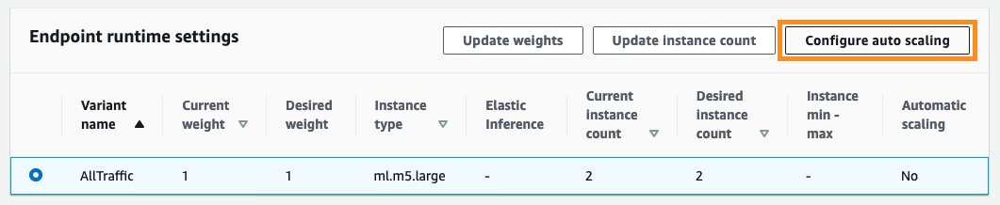
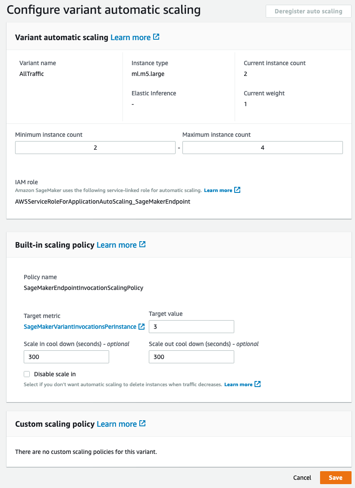
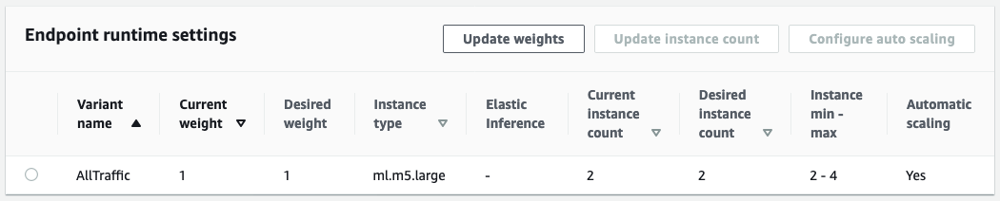

## Amazon SageMaker MXNet inference 컨테이너를 활용한 확장성 있는 KoGPT2 모델 배포하기


## 목적

오픈 소스로 공개된 한글 데이터로 학습된 GPT-2 모델인 KoGPT2 모델을 Amazon SageMaker에 배포하기 위해서는 MXNet inference 컨테이너에 KoGPT2 패키지와 관련 패키지들을 설치해서 사용해야합니다. 이 글은 커스텀 컨테이너 이미지를 만들고, 이를 Amazon  Elastic Container Registry(ECR)에 등록하고, 모델을 Amazon S3에 올린 후, Amazon SageMaker로 모델을 배포하는 것을 살펴보겠습니다. 마지막으로 간단한 inference 속도 테스트를 수행해서 적절한 인스턴스 종류를 선택하는 방법을 알아봅니다.

## 1단계: MXNet inference 컨테이너 확장하기

### EC2 사용하기 (option) ### 
컨테이너를 빌드할 (GPU)서버가 없다면 EC2 GPU 를 사용하고, AMI는 Deep Learning AMI (Ubuntu 18.04) 등을 사용하면 됩니다. 

### 컨테이너 Git repository 복제하기

우선 MXNet serving 컨테이너의 git repository를 복제합니다. docker가 설치되어 있는 곳에서 수행해야하며, GPU는 필요하지 않습니다. Amazon EC2 인스턴스 또는 Amazon SageMaker의 노트북 인스턴스에서 수행하는 것을 추천합니다.

```bash
git clone https://github.com/aws/sagemaker-mxnet-serving-container.git

cd sagemaker-mxnet-serving-container
```

### KoGPT2 설치를 위해서 Dockerfile 업데이트하기

다음으로는 `Dockerfile`을 수정합니다. 우리는 GPU 및 Apache MXNet 1.6.0, Python 3.6를 지원하는 컨테이너 이미지를 만들기 위해서 `./docker/1.6.0/py3/Dockerfile.gpu` 파일을 수정할 것입니다. Apache MXNet 및 관련 패키지를 설치하는 문장 다음에 KoGPT2를 설치하는 명령행들을 추가합니다. 아래 예제에서 마지막 7 줄이 추가해야 할 내용입니다.

> CPU 버전의 컨테이너 이미지를 만들고 싶다면 `./docker/1.6.0/py3/Dockerfile.cpu` 파일을 수정합니다. 

```bash
RUN ${PIP} install --no-cache-dir \
    ${MX_URL} \
    git+git://github.com/dmlc/gluon-nlp.git@v0.9.0 \
    gluoncv==0.6.0 \
    mxnet-model-server==$MMS_VERSION \
    keras-mxnet==2.2.4.1 \
    numpy==1.17.4 \
    onnx==1.4.1 \
    "sagemaker-mxnet-inference<2"

# For KoGPT2 installation
RUN git clone https://github.com/SKT-AI/KoGPT2.git \
&& cd KoGPT2 \
&& ${PIP} install -r requirements.txt \
&& ${PIP} install .
RUN ${PIP} uninstall -y mxnet ${MX_URL}
RUN ${PIP} install ${MX_URL}
```
### 컨테이너 이미지 만들기

컨테이너 이미지를 만들어 보겠습니다. `docker build` 명령을 수행하기 전에 필요한 파일들을 `./docker/1.6.0/py3` 디렉토리에 복사합니다. 여기서는 컨테이너 이름과 태그로 `preprod-mxnet-serving:1.6.0-gpu-py3`를 사용합니다.

```bash
cp -r docker/artifacts/* docker/1.6.0/py3

cd docker/1.6.0/py3

docker build -t preprod-mxnet-serving:1.6.0-gpu-py3 -f Dockerfile.gpu .
```

> CPU 버전의 컨테이너 이미지를 만드는 경우, 위 마지막 명령행에서  `Dockerfile.gpu`를 `Dockerfile.cpu`로 바꿔서 수행합니다.

### 컨테이너 이미지 테스트하기

컨테이너 이미지 만들기가 완료되었다면, 잘 동작하는지 확인해 보겠습니다. 컨테이너 이미지로 컨테이너를 실행한 후, 쉘 접근이 잘되는지 확인합니다. 방법은 `docker run` 및 `docker exec` 명령을 여러분의 컨테이너 ID와 컨테이너 이름을 지정하서 실행합니다. 그 후, 해당 컨테이너의 쉘로 들어가서 `pip list|grep kogpt` 명령 수행으로  패키지가 잘 설치되었는지 확인해 봅니다. GPU가 있는 인스턴스에서 GPU 테스트를 하고자 하는 경우에는 [nvidia-docker2](https://github.com/NVIDIA/nvidia-docker)를 설치한 후, 아래  `docker run` 명령에 `--gpus all`을 사용합니다. 만약 GPU를 사용하지 않을 경우에는 `--gpus all`을 생략해주세요.

```bash
# find docker image id
$ docker images
REPOSITORY                                            TAG                               IMAGE ID            CREATED             SIZE
preprod-mxnet-serving                                 1.6.0-gpu-py3                     0012f8ebdcab        24 hours ago        6.56GB
nvidia/cuda                                           10.1-cudnn7-runtime-ubuntu16.04   e11e11484e2e        3 months ago        1.71GB

# run docker
$docker run --gpus all <docker image id>

$ docker ps
CONTAINER ID        IMAGE               COMMAND                  CREATED             STATUS              PORTS               NAMES
af357bce0c53        0012f8ebdcab        "python /usr/local/b…"   7 hours ago         Up 7 hours          8080-8081/tcp       xxxxxx

# access shell of the running docker
$ docker exec -it <container name> /bin/bash
```

### 컨테이너 이미지를 Amazon ECR에 올리기

이제 우리는 KoGPT2 패키지가 설치된 컨테이너 이미지를 Amazon Elastic Container Registry(ECR)에 등록할 준비가 되었습니다. Amazon SageMaker에서 Amazon ECR에 등록된 이미지를 사용할 예정입니다. 자세한 내용은 Amazon ECR 문서의  “[Pushing an Image](https://docs.aws.amazon.com/AmazonECR/latest/userguide/docker-push-ecr-image.html)”를 참조해주세요. 간단히 설명하자면, 네 단계를 따르면 됩니다. 첫번째 단계는, docker를 Amazon ECR 레지스트리에 인증하는 것입니다. `get-login-password` 명령을 사용합니다. AWS CLI 1.17.0 또는 이전 버전을 사용하는 경우, `docker login` 명령을 얻기 위해서 아래 명령을 수행합니다. 만약 AWS CLI 1.17.0 보다 높은 버전을 사용하는 경우에는 “[Using an Authorization Token](https://docs.aws.amazon.com/AmazonECR/latest/userguide/Registries.html#registry_auth)”  참고하세요. 아래 명령 수행 결과를 복사해서 수행하면 docker가 인증을 받습니다.

```bash
$ aws ecr get-login --no-include-email --region <AWS region name> 
```
그럼 대략 아래와 같은 명령어를 출력합니다.
```bash
docker login -u AWS -p h3YlFJQkFEQm9CZ2...NX0= https://294038372338.dkr.ecr.us-west-2.amazonaws.com
```
이 명령어를 복사해 실행 시킵니다. 그럼 아래와 같이 성공적으로 login 했다는 정보를 볼수 있습니다.

```bash
...
Configure a credential helper to remove this warning. See
https://docs.docker.com/engine/reference/commandline/login/#credentials-store

Login Succeeded 
```


### Amazon ECR 리포지토리 만들기

두 번째로 해야 할 일은 Amazon ECR 리포지토리를 만드는 것입니다. AWS 콘솔을 이용하거나 AWS CLI를 이용할 수 있는데, 여기서는 AWS CLI를 이용하겠습니다. 사용할 명령은 `aws ecr create-repository` 입니다. 만약 이미 만들어져 있는 리포지토리를 사용할 예정이면 다음 단계로 넘어가세요. 

```bash
$ aws ecr create-repository --repository-name <repository name> --region <AWS region name>
```
예로 리포지토리 이름은 `kogpt2` 라고 하고, 서울 리전을 사용하기 위해서 `<AWS region name>`에 `us-west-2` 으로 지정하세요.

```bash
$ aws ecr create-repository --repository-name kogpt2 --region us-west-2
```

그럼 아래와 같은 출력을 볼수 있습니다.
```json
{
    "repository": {
        "repositoryArn": "arn:aws:ecr:us-west-2:12345678:repository/kogpt2",
        "registryId": "12345678",
        "repositoryName": "kogpt2",
        "repositoryUri": "12345678.dkr.ecr.us-west-2.amazonaws.com/kogpt2",
        "createdAt": 1591436054.0
    }
}
```
### 이미지에 새로운 태그를 부여하기

리포지토리 이름을 사용해서 이미지에 새로운 태그를 부여합니다. `docker image` 명령으로 컨테이너 이미지 ID를 얻은 후, `docker tag` 명령을 해당 이미지 ID와 리포지토리 URI를 적용해서 수행합니다. 위 create-repository에서 나온 `repositoryUri`를 사용하면 됩니다. 

```json
...
        "repositoryUri": "12345678.dkr.ecr.us-west-2.amazonaws.com/kogpt2",
...
```

```bash
$ docker images
REPOSITORY              TAG                               IMAGE ID            CREATED             SIZE
preprod-mxnet-serving   1.6.0-gpu-py3                     698f5cefa0cf        5 hours ago         6.56GB
nvidia/cuda             10.1-cudnn7-runtime-ubuntu16.04   e11e11484e2e        3 months ago        1.71GB

$ docker tag <image id> 12345678.dkr.ecr.us-west-2.amazonaws.com/kogpt2

$ docker images
REPOSITORY                                            TAG                               IMAGE ID            CREATED             SIZE
preprod-mxnet-serving                                 1.6.0-gpu-py3                     0012f8ebdcab        2 minutes ago       6.56GB
12345678.dkr.ecr.us-west-2.amazonaws.com/kogpt2   latest                            0012f8ebdcab        2 minutes ago       6.56GB
nvidia/cuda                                           10.1-cudnn7-runtime-ubuntu16.04   e11e11484e2e        3 months ago        1.71GB
```

### Amazon ECR 리포지토리에 이미지 올리기

마지막 단계로 이미지를 Amazon ECR 리포지토리에 올리면 됩니다. `docker image` 명령 수행 결과로 얻은 리포지토리 이름을 사용합니다. 

```bash
$ docker push 12345678.dkr.ecr.us-west-2.amazonaws.com/kogpt2

1232d7d696f8: Pushed
...
latest: digest: sha256:66bc1759a4d2e94daff4dd02446024a11c5af29d9259175f11701a0b9ee2d2d1 size: 4934
```

그런다음 `aws ecr list-images` 명령으로 이미지가 잘 올라갔는지 확인합니다.

$ aws ecr list-images --repository-name kogpt2
{
    "imageIds": [
        {
            "imageDigest": "sha256:66bc1759a4d2e94daff4dd02446024a11c5af29d9259175f11701a0b9ee2d2d1",
            "imageTag": "latest"
        }
    ]
}
```

## 2단계: 모델을 Amazon S3에 올리기

여러분의 자연어처리(NLP, Natual Language Processing) 문제를 해결하기 위해서 KoGPT2 pre-trained 모델을 fine-tuning을 수행할 수 있지만, 여기서는 간단하게 pre-trained KoGPT2 모델을 Amazon SageMaker에 배포해서 문장을 완성하는 예제를 사용하겠습니다.

우선  [KoGPT2 git repository](https://github.com/SKT-AI/KoGPT2) 를 clone한다음 에 있는 예제를 수행한 후, `~/kogpt2` 디렉토리에 2개 파일이 생성된 것을 확인합니다. 하나는 Apache MXNet 모델 파라메터 파일이고, 다른 하나는 sentencepiece 단어 파일입니다. 이 두 파일을 .tar.gz으로 묶어서 여러분의 Amazon S3 버킷에 올립니다.

```bash
$ cd ~/kogpt2
$ tar cvfz model.tar.gz ./*.params ./*.spiece
$ aws s3 cp ./model.tar.gz s3://<your bucket name>/gpt2-model/model.tar.gz
```

## 3단계: 모델을 Amazon SageMaker로 배포하기

자, 드디어 MXNet inference 컨테이너 이미지와 모델 아티팩트(.tar.gz 파일)가 각각 Amazon ECR 및 Amazon S3 버킷에 준비되었으니, Amazon SageMaker를 이용해서 모델을 배포할 수 있습니다. 모델을 배포하는 것은 모델 객체와 endpoint 설정을 만들고, 이 설정을 이용해서 endpoint를 만드는 것을 의미합니다. 이 일은 SageMaker Python SDK를 이용하면, `MXNetModel` 객체를 정의해서 `deploy()` 함수를 호출하는 것으로 간단히 해결할 수 있습니다.

`MXNetModel` 객체를 정의하고 배포하는 것을 수행하기에 앞서서, inference에 사용할 python 코드를 준비해야 합니다. 이 코드는 SageMaker MXNet Model Server가 정의한 인터페이스들 `model_fn()`와 `transform_fn()`을 구현합니다. `model_fn()` 함수는 모델을 메모리로 로딩하는 방법을 정의하고, `transform_fn()`은 사용자로부터 입력받은 내용을 변환하고, inference를 수행한 후, 그 결과를 변환하는 것을 정의합니다. (즉, 입력에 대한 전처리, 추론, 추론 결과에 대한 후처리) 만약 이 기능들을 서로 다른 함수로 정의하고자 한다면, `transform_fn()`를 구현하는 대신 `input_fn()`, `predict_fn()`, 그리고 `output_fn()` 에 각각 구현을 하면 됩니다. 보다 자세한 내용은 SageMaker Python SDK문서의 “[The SageMaker MXNet Model Server](https://sagemaker.readthedocs.io/en/stable/using_mxnet.html#the-sagemaker-mxnet-model-server)”를 참고하세요.

```python
import os
import json
import glob
import time
    
import mxnet as mx
import gluonnlp as nlp

from gluonnlp.data import SentencepieceTokenizer
from kogpt2.model.gpt import GPT2Model as MXGPT2Model
from kogpt2.utils import get_tokenizer

def get_kogpt2_model(model_file,
                     vocab_file,
                     ctx=mx.cpu(0)):
    vocab_b_obj = nlp.vocab.BERTVocab.from_sentencepiece(vocab_file,
                                                         mask_token=None,
                                                         sep_token=None,
                                                         cls_token=None,
                                                         unknown_token='<unk>',
                                                         padding_token='<pad>',
                                                         bos_token='<s>',
                                                         eos_token='</s>')
    mxmodel = MXGPT2Model(units=768,
                          max_length=1024,
                          num_heads=12,
                          num_layers=12,
                          dropout=0.1,
                          vocab_size=len(vocab_b_obj))
    mxmodel.load_parameters(model_file, ctx=ctx)
    
    return (mxmodel, vocab_b_obj)

def model_fn(model_dir):    
    voc_file_name = glob.glob('{}/*.spiece'.format(model_dir))[0]
    model_param_file_name = glob.glob('{}/*.params'.format(model_dir))[0]
    
    # check if GPU is available
    if mx.context.num_gpus() > 0:
        ctx = mx.gpu()
    else:
        ctx = mx.cpu()
        
    model, vocab = get_kogpt2_model(model_param_file_name, voc_file_name, ctx)
    tok = SentencepieceTokenizer(voc_file_name)
    
    return model, vocab, tok, ctx

def transform_fn(model, request_body, content_type, accept_type):
    model, vocab, tok, ctx = model
    
    sent = request_body.encode('utf-8')
    sent = sent.decode('unicode_escape')[1:]
    sent = sent[:-1]
    toked = tok(sent)
    
    t0 = time.time()
    inference_count = 0
    while 1:
      input_ids = mx.nd.array([vocab[vocab.bos_token]]  + vocab[toked]).expand_dims(axis=0)
      pred = model(input_ids.as_in_context(ctx))[0]
      gen = vocab.to_tokens(mx.nd.argmax(pred, axis=-1).squeeze().astype('int').asnumpy().tolist())[-1]
      if gen == '</s>':
        break
      sent += gen.replace('▁', ' ')
      toked = tok(sent)
      inference_count += 1
    
    response_body = json.dumps([sent, inference_count, time.time() - t0])
    
    return response_body, content_type
    
```

`MXNetModel` 객체를 만들 때, Amazon SageMaker에서 기본으로 제공하는 MXNet inference 컨테이너 대신에 앞에서 만든 컨테이너 이미지를 사용하기 위해서, 우리가 만든 컨테이너 이미지 URI를 `image` 파라메터 값으로 전달합니다. GPU를 사용하는 inference를 원하는 경우에는 GPU 용으로 만든 컨테이너 이미지 URI를 사용하고, CPU를 사용하는 inference를 원하는 경우에는 CPU 용으로 만든 이미지 URI를 지정합니다. 그리고, Inference 코드가 구현되어 있는 python 파일 이름을 `entry_point` 의 값으로 전달합니다.

하나의 Inference 인스턴스에 몇 개의 worker를 수행할지를 `model_server_workers` 파라미터를 통해서 지정할 수 있습니다. 이 글을 쓰는 2020년 3월 31일 현재는 기본 worker는 1로 설정되어 있습니다. 배포에 사용되는 인스턴스의 CPU 또는 GPU들을 모두 사용하기 위해서는 이 값을 늘려주는 것이 필요합니다. 하지만, 너무 큰 수를 설정하면 메모리 부족 오류가 발생할 수 있으니, CPU 개수 또는 GPU 개수보다 같거나 작도록 설정합니다.

```python
import sagemaker
from sagemaker.mxnet.model import MXNetModel
from sagemaker import get_execution_role

sagemaker_session = sagemaker.Session()
role = get_execution_role()

model_data = 's3://<your bucket name>/gpt2-model/model.tar.gz'
entry_point = './gpt2-inference.py'

mxnet_model = MXNetModel(model_data=model_data,
                         role=role,
                         entry_point=entry_point,
                         py_version='py3',
                         framework_version='1.6.0',
                         image='<AWS account id>.dkr.ecr.<AWS region>.amazonaws.com/kogpt2:latest',
                         model_server_workers=2
                        )
```

드디어 우리는 `deploy()` 함수를 수행해서 모델을 배포할 수 있습니다. 마지막으로 필요한 설정은 ML 인스턴스 종류 및 최소 인스턴스 개수입니다.

```python
predictor = mxnet_model.deploy(instance_type='ml.c5.large', initial_instance_count=1)
print(predictor.endpoint)
```

오토 스캐일링은 기본으로 비활성화되어 있습니다. 오토 스케일링은 AWS 콘솔을 통해서 설정할 수 있고, 자세한 내용은 “[Auto Scaling is now available for Amazon SageMaker](https://aws.amazon.com/blogs/aws/auto-scaling-is-now-available-for-amazon-sagemaker/)” 블로그와 Amazon SageMaker 문서의 “[Define a scaling policy](https://docs.aws.amazon.com/sagemaker/latest/dg/endpoint-auto-scaling-add-code-define.html)” 를 참고하세요. 여기서는 간단한 설정으로 활성화를 해보겠습니다. Amazon SageMaker 콘솔로 이동해서, 오토 스케일링을 설정을 하고 싶은 endpoint를 선택하세요. Endpoint 상세 페이지의 `Endpoint runtime setting`로 이동합니다. 설정하고자 하는 variant를 선택하고, `Configure auto scaling` 버튼을 클릭합니다.



설정 페이지에서 최소 및 최대 인스턴스 개수 및 스캐일링 정책을 설정합니다. 스캐일링 정책은 언제 스캐일링이 일어나야 하는지, cool down 기간을 어떻게 할지를 정의합니다. 원하는 설정값을 입력한 후, 이를 적용하기 위해서 `Save` 버튼을 누릅니다.



오토 스캐일링이 설정이 완료되면 `Automatic scaling`의 값이 `Yes`로 바뀐 것을 확인할 수 있습니다.




## Inference 속도 측정해보기

배포한 모델을 운영 환경에서 사용하기 전에, 모델 inference 속도를 측정해서 적당한 ML 인스턴스 종류를 선택했는지를 확인하는 것은 최소한의 검증일 것입니다. 부하 테스트를 수행하고자 한다면,  “[Load test and optimize an Amazon SageMaker endpoint using automatic scaling](https://aws.amazon.com/blogs/machine-learning/load-test-and-optimize-an-amazon-sagemaker-endpoint-using-automatic-scaling/)”  블로그를 참고하세요. 여기서는 간단한 모델 속도 측정을 위해서, 모델 endpoint를 반복적으로 호출해서 각 응답이 오는 시간의 평균을 구해보겠습니다. `endpoint_name` 변수의 값을 여러분이 위에서 배포한 endpoint 이름으로 바꿔주시고, 만약 다른 문장을 완성해보고 싶으면 `input_sentence` 의 값도 바꿔볼 수 있습니다.

```python
import sagemaker
from sagemaker.mxnet.model import MXNetPredictor

sagemaker_session = sagemaker.Session()

endpoint_name = '<ENDPOINT 이름>'
predictor = MXNetPredictor(endpoint_name, sagemaker_session)

input_sentence = '아기 공룡 둘리는 희동이와'

pred_latency_sum = 0
pred_count_sum = 0
pred_cnt = 0

for i in range(20):
  try:
    pred_out = predictor.predict(input_sentence)
    if i == 0:
      continue
    
    predicted_sentence= pred_out[0]
    predict_count = pred_out[1]
    predict_latency = pred_out[2]
  
    pred_latency_sum += predict_latency
    pred_count_sum =+ predict_count
    pred_cnt += 1
  except:
    print('Error and ingore it.')

avg_latency = pred_latency_sum / pred_cnt
avg_latency_per_inf = avg_latency / pred_count_sum

print('Input sentence: {}'.format(input_sentence))
print('Predicted sentence: {}'.format(predicted_sentence))
print('Average number of inferenced token: {:.2f}'.format(pred_count_sum))
print('Average inference latency for a sentence completion: {:.2f}'.format(avg_latency))
print('Average inference latency per a token: {:.2f}\n'.format(avg_latency_per_inf))
```

이 코드는  “아기 공룡 둘리는 희동이와”라는 문장의 일부를 입력으로 모델에 전달해서 문장을 완성해보는 예제입니다. 문장의 종료 토큰이 생성될 떄까지 다음 토큰에 대한 inference를 반복하면서 다음과 같이 문장을 완성합니다.

```
아기 공룡 둘리는 희동이와
아기 공룡 둘리는 희동이와 함께
아기 공룡 둘리는 희동이와 함께 공룡
아기 공룡 둘리는 희동이와 함께 공룡을
아기 공룡 둘리는 희동이와 함께 공룡을 사냥
아기 공룡 둘리는 희동이와 함께 공룡을 사냥하는
아기 공룡 둘리는 희동이와 함께 공룡을 사냥하는 모습을
아기 공룡 둘리는 희동이와 함께 공룡을 사냥하는 모습을 담았다
아기 공룡 둘리는 희동이와 함께 공룡을 사냥하는 모습을 담았다.
```

위 예제를 사용한 경우, 여러 인스턴스 종류별로 모델을 배포해서 inference 속도를 측정한 결과 GPU를 사용하는 경우 CPU 보다 약 4배 정도 빠른 것으로 측정되었습니다. 이를 고려하면, 조금 더 빠른 실시간 inference가 필요한 서비스에 사용할 경우에는 GPU 인스턴스를 사용하고, 그렇지 않은 경우에는 CPU 인스턴스를 사용하는 등의 선택을 할 수 있습니다. 단, 정확한 성능 테스트를 위해서 여러분의 모델 및 다양한 설정(인스턴스 종류, 개수, worker 수)를 통해서 직접 수행하기 바랍니다.

| CPU/GPU    | ML 인스턴스 종류 | 평균 inference 시간 (초/토큰) |
| -------------- | ---------------- | ------------------------------------------------- |
| CPU            | ml.c4.2xlarge | 0.15                                     |
|| ml.c5.2xlarge | 0.19                                 |
|| ml.m4.2xlarge | 0.17   |
|| ml.m5.2xlarge | 0.21     |
|| ml.r5.2xlarge | 0.21     |
|| ml.t2.2xlarge | 0.17     |
| GPU            | ml.p2.xlarge | 0.09                                       |
|| ml.p3.2xlarge | 0.05     |
|| ml.g4dn.2xlarge | 0.04        |


## 정리하기

자, 실험이 모두 끝났고 더 이상 자원들을 사용할 필요가 없다면, 아래 명령으로 SageMaker endpoint, endpoint 설정, 및 모델을 삭제합니다.

```python
predictor.delete_endpoint()
predictor.delete_model()
```

그리고, Amazon ECR 콘솔에서 이미지 및 리포지토리를 삭제하고, Amazon S3 버킷도 삭제하세요.

## 결론

MXNet inference 컨테이너 이미지를 확장해서 KoGPT2 모델 및 이를 활용한 NLP 모델을 Amazon SageMaker을 이용해서 확장성이 있는 모델 추론 환경을 구성하는 것을 배웠습니다. 

## 참고자료

- KoGPT2 https://github.com/SKT-AI/KoGPT2
- GluonNLP https://gluon-nlp.mxnet.io/
- SageMaker MXNet serving container git repository https://github.com/aws/sagemaker-mxnet-serving-container
- Amazon SageMaker Python SDK - Deploy Endpoints from Model Data https://sagemaker.readthedocs.io/en/stable/using_mxnet.html#deploy-endpoints-from-model-data
- MXNet Model Serving sample https://github.com/awslabs/amazon-sagemaker-examples/blob/master/sagemaker-python-sdk/mxnet_gluon_sentiment

